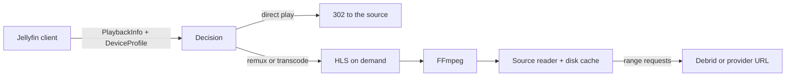

# Transcoding design

Polyfin plays remote streams: debrid and provider URLs that are unknown until playback, can expire, may require request headers, and make every seek a new network request. Jellyfin's transcoder is built around local files analyzed when a library is scanned. Polyfin therefore has its own transcoder, designed for remote sources and written from scratch. It runs upstream FFmpeg and ffprobe as separate processes.

The architecture borrows ideas, not code, from the transcoder of [Kyoo](https://github.com/zoriya/Kyoo): lazy HLS, segments cut on the source's keyframes, remuxing offered as one of the qualities, and encodes shared between viewers. Kyoo lets clients choose a quality from the playlist without negotiation; Jellyfin clients negotiate through a `DeviceProfile`, so Polyfin does both.

## Components

### Source reader

FFmpeg and ffprobe never open the remote URL. They read an internal Polyfin URL, served by a reader that:

- fetches the source in 1 MiB blocks with range requests and keeps them in a bounded disk cache, so a seek or an FFmpeg restart reads the cache instead of downloading again. Blocks are stored in files of 64 MiB, and the least recently read files are evicted first, so reading a long file to its end stays within the limit; what was read in the last 30 seconds is kept;
- opens one upstream connection per source, whatever the number of FFmpeg processes, which respects debrid limits on concurrent connections. It reads ahead of the last reader, and serves the blocks readers wait for before the ones read ahead;
- adds the request headers a stream requires (Stremio `behaviorHints.proxyHeaders`);
- when the link expires (HTTP 401, 403, 404 or 410), asks the addon for the **same release** again (same file name and size) and resumes transparently; a busy source (HTTP 429 or 5xx) is retried, honoring `Retry-After`;
- accounts bandwidth per user.

### Analysis

On the first playback of a source, cached in PostgreSQL per media source:

- **ffprobe** gives the exact container, codecs, profiles, bit depth, HDR and Dolby Vision type, audio channels, duration and subtitle tracks. Parsing release names is not reliable enough to decide how to play a file.
- **Keyframe index**, read on the first remux from the container's own index with a few range requests instead of the whole file: Matroska `Cues` (FFmpeg's muxer lists every video keyframe there) and the MP4 sample tables (`stts`, `ctts`, `stss` and the edit list). A file without one (Matroska written without `Cues`, fragmented MP4, MPEG-TS) is not remuxed.

### Decision

Each media source is matched against the client's `DeviceProfile` (direct play, transcoding, codec and subtitle profiles, maximum bitrate), cheapest level first:

| Level | What happens | Server cost |
| --- | --- | --- |
| Direct play | The stream URL answers with a 302 to the source, once the source has answered a one-byte range request; Polyfin relays the bytes instead when the app could not reach the source (request headers, a local network address) or follow the redirect (Findroid, from HTTP to HTTPS) | None, or bandwidth when relaying |
| Remux | Video and audio copied into HLS; HDR and Dolby Vision untouched. Offered when the app's HLS transcoding profile takes the video codec and the codec and channels of the audio track that plays, and its codec profiles accept the remux, with the codec tag it writes (`hvc1` for HEVC in MP4, which Apple players require). A remux cannot lower the bitrate. | Low, no GPU |
| Audio transcode | Video copied as in a remux, audio converted (for example TrueHD or DTS to AAC). Offered when the video can be copied but the audio that plays cannot, or the app refuses the copy (`AllowAudioStreamCopy: false`). The audio becomes the first codec of the transcoding profile FFmpeg encodes in every build (AAC, AC-3, E-AC-3 or FLAC), with the source's channels up to the profile's `MaxAudioChannels` and 5.1, at about 64 kb/s a channel (192 kb/s in stereo). The `TranscodingUrl` asks for it with Jellyfin's `allowAudioStreamCopy=false`, and FFmpeg decodes the audio from the keyframe it starts on, as copied streams start, rather than from the time asked. | Low |
| Full transcode | Video re-encoded, audio copied or converted as above. Offered when the app's HLS profile cannot take the video, it exceeds the bitrate limit, or the app refuses the copy (`AllowVideoStreamCopy: false`, which jellyfin-web sends after a failed direct play). The video becomes 8-bit SDR H.264, HEVC when the profile takes only that, through the software encoders (`libx264`, `libx265`), at the tallest of 1080p, 720p, 540p, 480p and 360p whose bitrate the limit allows, never larger than the source nor above its bitrate. HDR is converted to SDR with `zscale` and `tonemap`, which costs about four times the encoding at 1080p: in software it stops at 720p, where it keeps up with playback. Dolby Vision without a base layer other players read (profile 5) is not converted, as its colors would come out wrong; interlaced video is deinterlaced. The `TranscodingUrl` asks for it with `allowVideoStreamCopy=false`. | High |

Every decision that is not direct play reports Jellyfin's `TranscodeReasons`.

### HLS on demand

- **Segments follow the source's keyframes.** Remuxed renditions are cut exactly there: each segment ends on the first keyframe 6 seconds or more after its start. Transcoded renditions force their keyframes at the same timestamps, a fraction of a frame early as the encoder rounds times to its frame rate. All renditions share one timeline: segments keep the source's timestamps, shifted by 10 seconds so that frames decoded before zero keep positive ones, so the segments of FFmpeg runs started at different places follow each other.
- **One variant** in the master playlist, as Jellyfin 12.1 returns: the quality PlaybackInfo chose for the app's bitrate limit. To change it, apps ask PlaybackInfo again, as Jellyfin apps do from their quality menu. Lower qualities, each converted by an FFmpeg of its own, were tried and dropped. A player measures how fast segments arrive, and a segment being converted arrives no faster than FFmpeg makes it, so hls.js in jellyfin-web read a slow connection on the local network. It switched quality several times while starting a 4K HDR conversion, each switch starting another FFmpeg: three ran at once, the CPU was saturated, and playback froze for about 40 seconds before settling where a single variant starts at once. Encoding every quality in one FFmpeg would avoid the switches, at a constant cost: about a third more on a 4K HDR source, about double on a 1080p one. That may be worth it with hardware encoding, where several sizes cost little.
- **Audio inside the video's segments**, as Jellyfin 12.1 serves it. To change the audio track during a transcode, jellyfin-web asks PlaybackInfo again with the new `AudioStreamIndex`, sends `DELETE /Videos/ActiveEncodings`, and loads a new master playlist from the current segment. Jellyfin apps are written for servers that offer no separate HLS audio renditions, so they would never pick one: Polyfin offers none, and a change of audio track starts the stream again where it plays.
- **Encoders start at the requested segment**, run a bounded window ahead of the player (10 segments), pause when far ahead, and stop on `Sessions/Playing/Stopped`, on `DELETE /Videos/ActiveEncodings` or after 3 idle minutes. A request more than 3 segments past the one being made, or before it, starts FFmpeg again from there; the source cache makes that cheap. Two viewers of the same source and quality will share one encoder.
- Segments are fragmented MP4 or MPEG-TS, as the client's transcoding profile asks.

### Hardware acceleration

At startup Polyfin asks FFmpeg which encoders and filters it has; software conversion uses `libx264` or `libx265`, and converts HDR only when `zscale` and `tonemap` are there. Hardware acceleration will encode a few test frames with each available method (VAAPI, Intel QSV, NVENC, VideoToolbox, Rockchip MPP) and keep those that work. Administrators can force a method. The FFmpeg build matters: HDR to SDR conversion needs `libplacebo` or `zscale`, which some distribution builds lack, so Polyfin adapts to what the installed FFmpeg offers. Polyfin requires FFmpeg 9.0 or later.

### Subtitles

A subtitle never costs a video transcode when a cheaper path exists. For each track and each app, Polyfin uses the first of these that works:

| Track | App renders it inside the file (`Embed`) | Otherwise |
| --- | --- | --- |
| Addon subtitle file | Not applicable | Converted to the format the app asks for: WebVTT, SubRip, ASS, or the JSON track events jellyfin-web reads |
| Embedded text (SubRip, ASS/SSA, WebVTT, mov_text) | Left in the file, in direct play | A segmented WebVTT rendition in HLS; an external track once remuxes have extracted all of it |
| Embedded image (PGS, VobSub, DVB) | Left in the file, in direct play and Matroska remux | Burned into the video, which needs a full transcode |

- **Extraction from remote sources.** Subtitle packets are interleaved through the whole file, so extracting an embedded track reads all of it: 40 to 80 GB for a Blu-ray remux. Polyfin therefore extracts text tracks while it remuxes or transcodes, from bytes it reads anyway: the FFmpeg that remuxes also converts every text track to WebVTT, each on a pipe of its own. Polyfin keeps the cues per version, with the spans of the version over which every cue was extracted, in PostgreSQL, so that later playbacks get them at once. A span counts once FFmpeg has written the video one segment past it, and half a second later: FFmpeg converts subtitles in threads of their own, which can lag behind the video it copies, and nothing tells a cue still on its way from no cue. Once the spans cover the whole version, its tracks are offered as external files too, to apps that take only those, such as jellyfin-web.
- **HLS renditions.** Players that only take subtitles from the playlist, such as AVPlayer in Swiftfin's native player, get segmented WebVTT renditions cut like the video, the addons' files and the extracted tracks alike. The cues keep the source's times; `X-TIMESTAMP-MAP` places them on the remux's timestamps, the source's shifted by 10 seconds. A segment of an extracted track waits for FFmpeg to cover it. As in Jellyfin, the master playlist lists them when the chosen subtitle is delivered in HLS, the chosen one as default, so that the player can switch between them.
- **Not yet.** ASS loses its styles and positions in WebVTT, and cues shown when a remux starts mid-file, but started before, are missing until a remux covers their start. Likewise, an image subtitle on screen where a conversion starts mid-file is missing until the next one: FFmpeg's Matroska demuxer skips the subtitle blocks stored before the point it seeks to, and reading them back would fetch the source before that point.
- **ASS/SSA** stays ASS for players that render it, so positions, styles and effects survive, together with the fonts the Matroska file carries as attachments (`MediaAttachments`). Attachments sit in one element near the start or the end of the file and are read with a few range requests. Other players get WebVTT or SubRip, without styles.
- **Image subtitles** cannot become text without OCR. When a player cannot render them, they are burned in: the only case where a subtitle forces a video transcode. The subtitle's canvas, the size of the video it was made for, is scaled to the width of the converted video and laid at its bottom, after the conversion to SDR, which would dim its colors. FFmpeg repeats the canvas for every packet it reads from the source, over a thousand a second with TrueHD audio: the canvas is first brought to the video's frame rate, which keeps burning in at about the cost of the conversion alone. A forced track, which only covers foreign-language passages, is burned in alone. Optional OCR into a reusable SubRip track (Tesseract) may come later; its quality varies.
- **Choice.** Polyfin follows Jellyfin's decision (`Embed`, then `External`, then `Hls`, then `Encode`) for the track the app asks for: an app shows the track it asked for, and would show nothing if another one were delivered. The forced track Polyfin picks when none is asked is a text one when there is one in the same language, so that only an image track the app asks for, or the only forced one, costs a transcode.
- **Timing and text.** After a seek in a transcoded stream, subtitle URLs carry the start position, and extracted tracks keep the source's timestamps. Text is served in UTF-8, with a fallback for legacy encodings.

Subtitles an app could only get burned in are left out of what it can play, rather than preventing it, when they are text, which Polyfin does not burn in yet, or when the video cannot be converted: FFmpeg lacks the encoder, or the version is Dolby Vision profile 5.

## Risks and fallbacks

- **Sources without an index** (Matroska without `Cues`, fragmented MP4, MPEG-TS) cannot be remuxed on exact boundaries: they are transcoded with fixed-length segments instead.
- **Variable-length segments** are valid HLS (`EXT-X-TARGETDURATION` is the longest segment, rounded up), but each player (AVPlayer, hls.js, ExoPlayer, mpv) must be tested.
- **Disk usage** of the source cache is bounded and configurable.

## Delivery order

1. Direct play and ffprobe analysis.
2. Remux, with the extraction of embedded text subtitles and fonts.
3. Software transcoding, with burned-in image subtitles.
4. Hardware acceleration.

## Verification

For the same media and each real client's `DeviceProfile`, Polyfin's `PlaybackInfo` decisions (direct play, direct stream or transcode, and `TranscodeReasons`) are compared with those of a real Jellyfin 12.1 server. FFmpeg command lines are Polyfin's own and are not compared.
