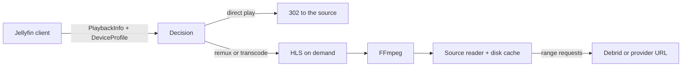

# Transcoding design

Polyfin plays remote streams: debrid and provider URLs that are unknown until playback, can expire, may require request headers, and make every seek a new network request. Jellyfin's transcoder is built around local files analyzed when a library is scanned. Polyfin therefore has its own transcoder, designed for remote sources and written from scratch. It runs upstream FFmpeg and ffprobe as separate processes.

The architecture borrows ideas, not code, from the transcoder of [Kyoo](https://github.com/zoriya/Kyoo): lazy HLS, segments cut on the source's keyframes, remuxing offered as one of the qualities, and encodes shared between viewers. Kyoo lets clients choose a quality from the playlist without negotiation; Jellyfin clients negotiate through a `DeviceProfile`, so Polyfin does both.

## Components

### Source reader

FFmpeg and ffprobe never open the remote URL. They read an internal Polyfin URL, served by a reader that:

- fetches the source in blocks with range requests and keeps them in a bounded disk cache, so a seek or an FFmpeg restart reads the cache instead of downloading again;
- opens one upstream connection per source, whatever the number of FFmpeg processes, which respects debrid limits on concurrent connections;
- adds the request headers a stream requires (Stremio `behaviorHints.proxyHeaders`);
- when the link expires (HTTP 403 or 410), asks the addon for the **same release** again (same infohash and file) and resumes transparently;
- accounts bandwidth per user.

### Analysis

On the first playback of a source, cached in PostgreSQL per media source:

- **ffprobe** gives the exact container, codecs, profiles, bit depth, HDR and Dolby Vision type, audio channels, duration and subtitle tracks. Parsing release names is not reliable enough to decide how to play a file.
- **Keyframe index**, read from the container's own index with a few range requests instead of the whole file: Matroska `Cues` and MP4 sync samples (`stss`).

### Decision

Each media source is matched against the client's `DeviceProfile` (direct play, transcoding, codec and subtitle profiles, maximum bitrate), cheapest level first:

| Level | What happens | Server cost |
| --- | --- | --- |
| Direct play | The stream URL answers with a 302 to the source, once the source has answered a one-byte range request; Polyfin relays the bytes instead when the app could not reach the source (request headers, a local network address) or follow the redirect (Findroid, from HTTP to HTTPS) | None, or bandwidth when relaying |
| Remux | Video and audio copied into HLS; HDR and Dolby Vision untouched | Low, no GPU |
| Audio transcode | Video copied, audio converted (for example TrueHD or DTS to AAC or E-AC-3) | Low |
| Full transcode | Video and audio re-encoded | High |

Every decision that is not direct play reports Jellyfin's `TranscodeReasons`.

### HLS on demand

- **Segments follow the source's keyframes.** Remuxed renditions are cut exactly there; transcoded renditions force their keyframes at the same timestamps. All renditions share one timeline, so a player can switch quality mid-playback, including between remux and transcode, without a gap.
- **Several variants** in the master playlist: the negotiated one first, lower qualities after. HLS master playlists with several variants are standard (RFC 8216) and Jellyfin servers already return them.
- **Audio tracks as separate renditions**, so changing language does not restart video encoding. Client support must be verified client by client.
- **Encoders start at the requested segment**, run a bounded window ahead of the player, pause when far ahead, and stop on `Sessions/Playing/Stopped` or when idle. Two viewers of the same source and quality share one encoder.
- Segments are fragmented MP4 or MPEG-TS, as the client's transcoding profile asks.

### Hardware acceleration

At startup Polyfin asks FFmpeg which encoders, decoders and filters it has, then encodes a few test frames with each available method (VAAPI, Intel QSV, NVENC, VideoToolbox, Rockchip MPP) and keeps those that work. Administrators can force a method. The FFmpeg build matters: HDR to SDR conversion needs `libplacebo` or `zscale`, which some distribution builds lack, so Polyfin adapts to what the installed FFmpeg offers. Polyfin requires FFmpeg 9.0 or later.

### Subtitles

Text subtitles (SRT, ASS, WebVTT) are converted to WebVTT and delivered as external tracks, without transcoding the video. Subtitle files from addons are converted to the format each app asks for: WebVTT, SubRip, ASS, or the JSON track events jellyfin-web reads. Image subtitles (PGS, VobSub) are burned into the video only when the client cannot render them; until Polyfin transcodes, subtitles an app cannot render are left out of what it can play rather than preventing direct play.

## Risks and fallbacks

- **Sources without an index** (Matroska without `Cues`, fragmented MP4, MPEG-TS) cannot be remuxed on exact boundaries: they are transcoded with fixed-length segments instead.
- **Variable-length segments** are valid HLS (`EXT-X-TARGETDURATION` is the longest segment, rounded up), but each player (AVPlayer, hls.js, ExoPlayer, mpv) must be tested.
- **Disk usage** of the source cache is bounded and configurable.

## Delivery order

1. Direct play and ffprobe analysis.
2. Remux.
3. Software transcoding.
4. Hardware acceleration.
5. Multiple variants and separate audio renditions.

## Verification

For the same media and each real client's `DeviceProfile`, Polyfin's `PlaybackInfo` decisions (direct play, direct stream or transcode, and `TranscodeReasons`) are compared with those of a real Jellyfin 12.1 server. FFmpeg command lines are Polyfin's own and are not compared.
